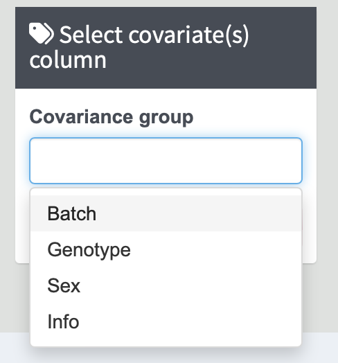
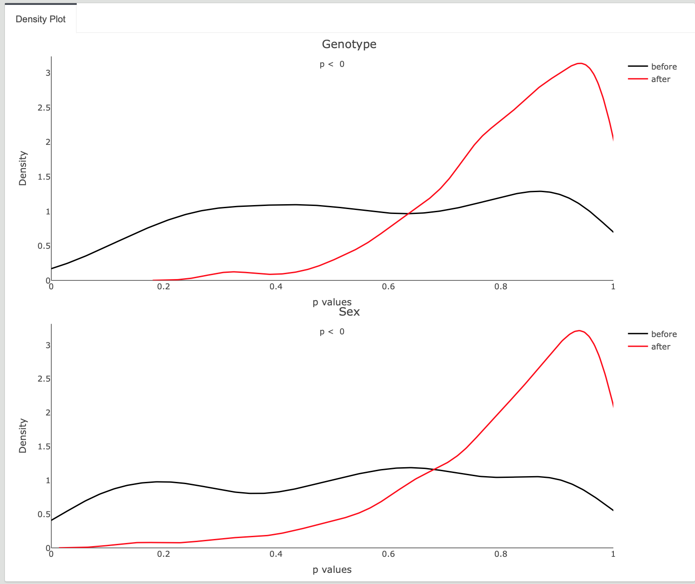

# Covariates Correction

Covariate correction is to adjust for potential confounding variables that may influence the results, especially for human samples. By accounting for these covariates, you can ensure that the observed effects are primarily due to the variables of interest rather than external factors. 

---

1. **Selecting Covariates Group Information**

   To perform covariate correction, select the covariates column(s) from your dataset that you want to adjust. You can select multiple co-variate factors. The selected parameters will be used in the correction process.

   {width=30%}
   
  By clicking the `[Run Correction]` button, the corrected result table will appear on the right side of the page.  
  JUMP shiny uses a simple regression model to remove the covariate factors and output the residuals. The correction is performed for each protein. 

   

2. **Density Plot**

   After the analysis, density plots were generated for each co-variate, showing the p-value of correlations before and after correction.

  {width=90%}
  {width=90%}
  