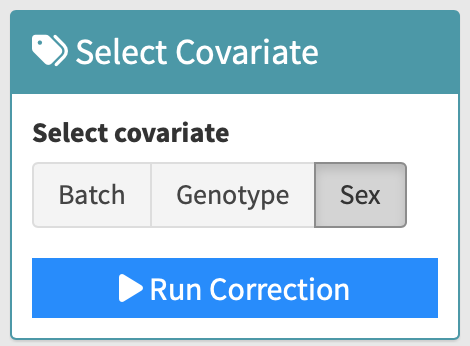

# Steps for Covariates Correction

---

1. **Input Covariates Group Information**

   Input your covariates group information in the text area, then click `Assign Covariates`.
   Ensure to include the header.

   {width=90%}

2. **Select Parameters for Correction**

   Click the parameters that you want to include in the correction. All the selected parameters are used in the correction.
   Click the `Run Correction` button, and the corrected result table will appear on the right.

   {width=30%}

3. **Density Plot**

   A density plot showing the p-value of correlation before and after correction will be displayed.
