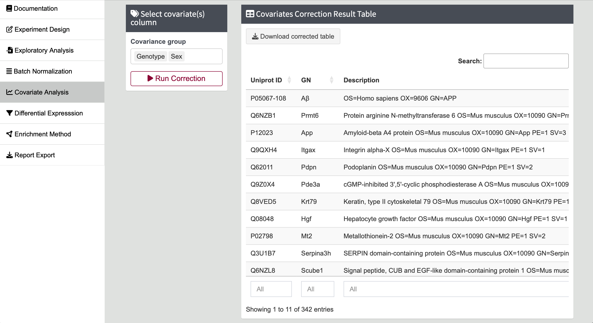

# Steps for Covariates Correction

---

1. **Input Covariates Group Information**

   Select the covariates column(s) that you want to correct. All the selected parameters will be used in correction.

   {width=30%}
   
  Click the `Run Correction` button, and the corrected result table will appear on the right.
   

2. **Density Plot**

   A density plot showing the p-value of correlation before and after correction will be displayed.

  {width=90%}
  {width=90%}
  