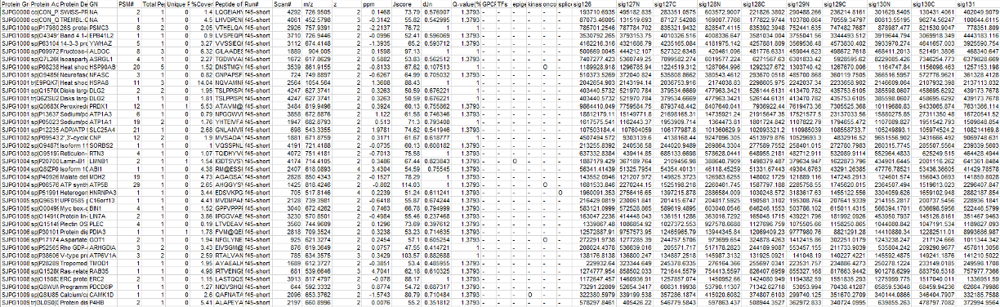
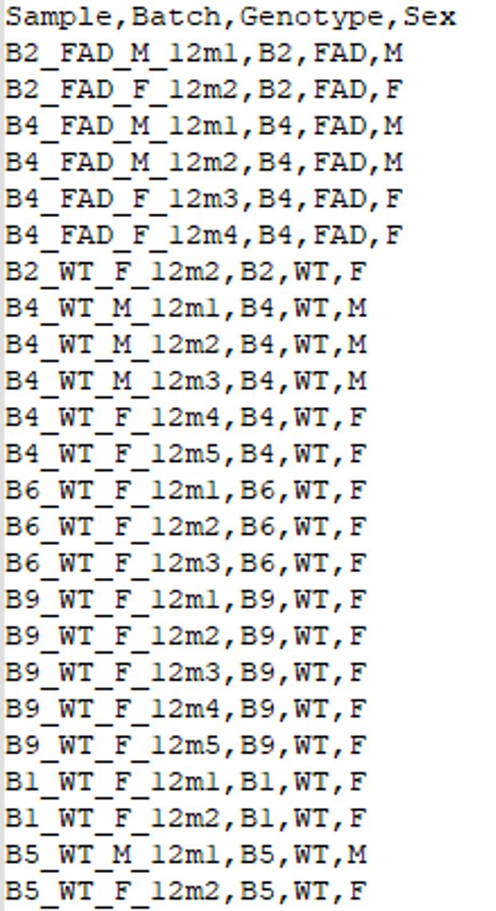
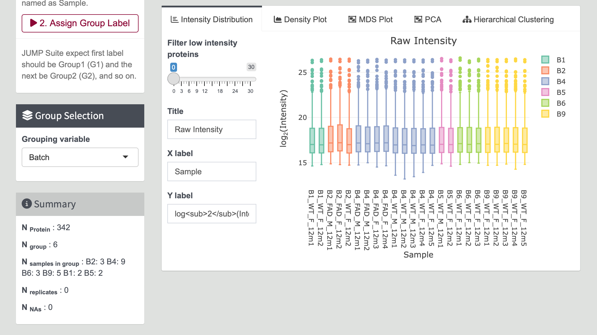
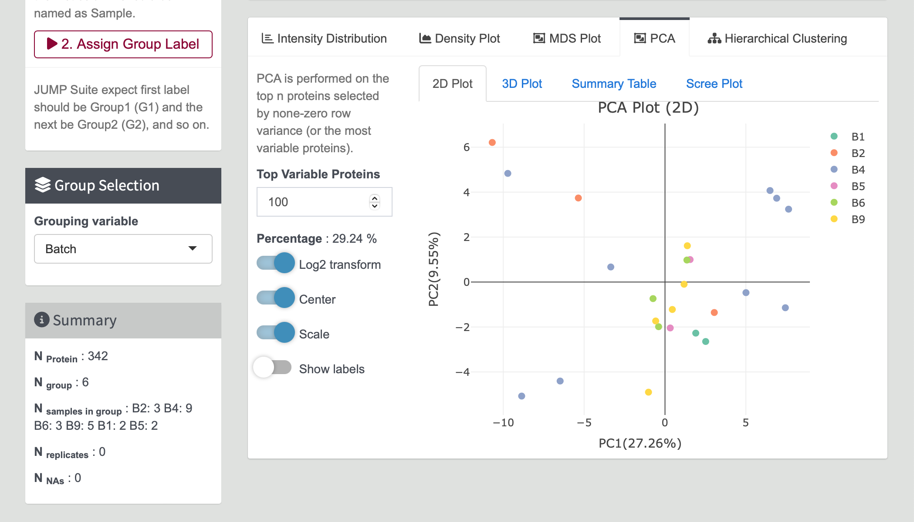

# Steps for Data Import

1. **Navigate to Exploratory Analysis Tab**

    Click on the `Exploratory Analysis` tab located in the left sidebar of this page.

    {width=90%} 

2. **Upload Data**

    At the top left, you have two options:

    - Click `[Example]` for an example illustration.
    - Click `[Upload]` to upload your own data, which should be in `tab-delimited text` or `csv file` format.

    Ensure your file follows the correct format shown below. For large datasets (over 5MB file), please use JUMP shiny in local.

    Data will be displayed after successful upload.

    {width=90%}

    ---
  
    **JUMP-shiny Data:**
    
    If your data contains Accession number, Gene Name, Description, and samples, use `jumpshiny` to upload. **The first column is required.**

    {width=90%}

    ---

    **JUMPq Result Format:**

    If your data sample starts from the 24th column, use `jumpq` to upload. Please remove the header rows of jumpq data.

    {width=90%}

    ---

    **JUMPq Batch Result Format:**

    If your data contains batch info, use `jump_batch` to upload.

    {width=90%}

3. **Group Assignment**

    After loading the dataset, input your grouping in the `[Group Assignment]` panel.

    {width=30%}

    - The first column should be your sample name (matching the column's name of your input dataset).
    - Only the columns listed here will be included in the analysis.
    - The second column is your grouping name (e.g., "control" or "sample").
    - Headers are required.

    {width=30%}

4. **Confirm and Analyze**

    Click the `[Confirmed]` button, wait for a while, and the `[Summary]` of Data and `[Sample Distribution]` will display more information about your dataset. Modify and save plots for further study or publication.

    {width=90%} 
      
    `PCA Plot` shows the distribution of selected groups based on PCA analysis.  
    {width=90%} 
      
    `Heatmap` shows the correlation within the data.  
    {width=90%}  

    Change the grouping to visualize results by selecting options in the `[Group Selection]` Panel.

    **Group Selection:**

    - Navigate to the `[Group Selection]` panel to explore different ways of grouping your data for visualization.
      - Choose the variables or categories by which you want to group your data. For example, you may group by experimental conditions, genes, sexes.  
        
    {width=40%}
    
    

