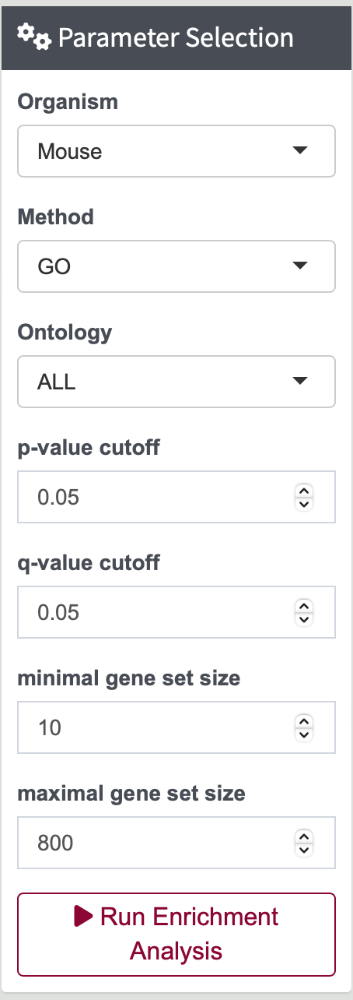

# Steps for Enrichment Analysis

---

1. **Select Proteins from Differential Expression Results**

    Choose proteins from the differential expression results for enrichment analysis. The filtered data will be displayed on the top right for verification.

    - For a tutorial, you can directly click on `p-val` and then `Run Significance Filter` as an example.

    {width=90%}

3. **Adjust Enrichment Analysis Parameters**

    Customize the parameters for the enrichment analysis. JUMP Suite offers three organism databases and three methods for enrichment analysis.

    {width=30%}

    Click `Run Enrichment Analysis` to initiate the analysis and obtain the result.

4. **Review Enrichment Analysis Results**

    The result table of the enrichment analysis will be displayed.

    {width=90%}

    Additional visualizations, such as `Dotplot` and `Enrichment Map`, will be available on the bottom right.

    {width=90%}
    {width=90%}
