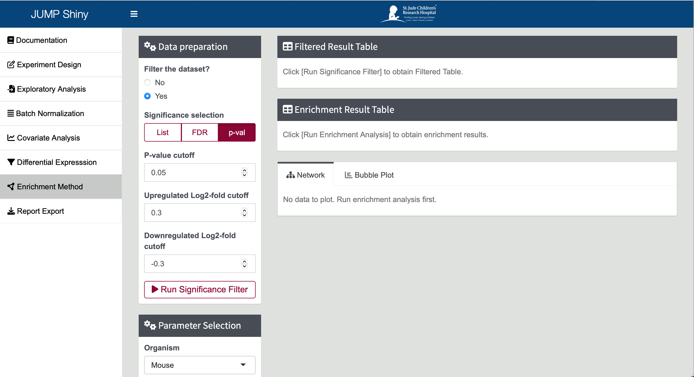
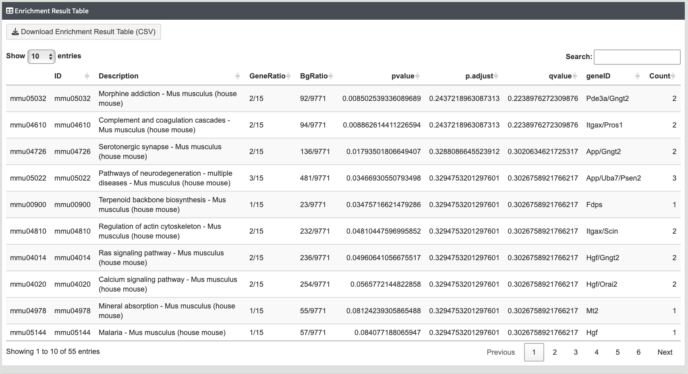
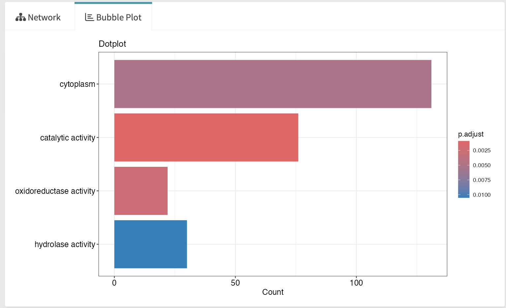

# Enrichment Analysis

**Enrichment Analysis** is used to identify biological pathways, processes, or molecular functions that are significantly overrepresented in your set of differentially expressed proteins. By mapping these differentially expressed elements to known databases and ontologies, such as Gene Ontology (GO), KEGG pathways, or Reactome pathways, enrichment analysis helps uncover the underlying biological mechanisms driving the observed changes. 

---
## Steps

1. **Select Proteins from Differential Expression Results**  

    To perform enrichment analysis, start by selecting proteins from the differential expression results. You have several options for defining this list: you can provide a specific list of proteins, or filter proteins based on their FDR or p-value. Additionally, you can further refine this list by applying a log2 fold change cutoff. These filtering options ensure that you focus on the most relevant proteins, enhancing the accuracy and biological relevance of the enrichment analysis. Once the selection is made, you can click `[Run Significance Filter]`. The filtered proteins will be shown in the `[Filtered Result Table]`. The number of proteins selected will be shown below the table.

    {width=90%}  

3. **Set Up Enrichment Analysis Parameters**

    You can customize the parameters for the enrichment analysis to suit your specific needs. The JUMP rshiny platform offers three organism databases (human, mouse, and rat) and two methods (GO and KEGG) for performing enrichment analysis. By selecting the appropriate database and method, you can tailor the analysis to your organism of interest and the specific biological questions you are investigating.  
    
    You can set various parameters including the p-value cutoff, q-value cutoff, minimal gene set size, and maximal gene set size. Once you have configured these settings, click the [Run Enrichment Analysis] button to start the analysis and generate the results.   

    {width=30%}

4. **Enrichment Analysis Results**

    The results of the enrichment analysis will be displayed in a comprehensive result table. This table provides detailed information about the enriched pathways, processes, or molecular functions, including relevant statistics such as p-values and q-values. By examining this table, you can identify the most significant biological themes and mechanisms associated with your differentially expressed proteins or genes. You can download the enrichment result table in csv format. 

    {width=90%}

5. **Visualization of Enrichment Analysis Results**

    JUMP shiny provides two plots for visualizing the results of the enrichment analysis:  
    - Bubble Plot: This plot displays the most significantly enriched pathways, processes, or functions in a clear and easy-to-interpret dot graph format. Each bubble represents a specific enriched category, with the size of the bubble corresponding to the number of proteins in the enriched pathway. The color of each dot represents the significant level of the enriched pathway (i.e., adjusted *p* value)  
    
    {width=50%}
    
    - Network Map: This plot presents a network map that illustrates the relationships and interactions between the enriched pathways or functions. The network map helps in understanding the interconnectedness of various biological processes and identifying key regulatory nodes.

    {width=50%}