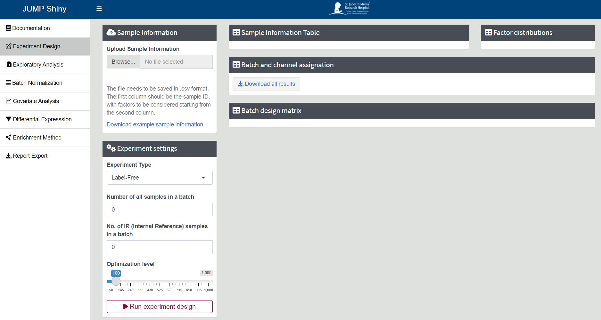

# Experiment Design

**Experiment Design** offers tools for organizing sample processing sequences in proteomics experiments. By using block randomization, it assigns samples to different batches, minimizing batch effects and reducing the risk of introducing confounders that could bias data interpretation.

The `Experiment Design` algorithm comprises three key procedures:

- Generating a batch design matrix based on the distribution of the first explanatory variable, while considering the specified number and size of batches.
- Allocating samples to each batch, factoring in the distribution of the second explanatory variable.
- Optimizing the batch design scenario for the third and subsequent variables.

---

## Steps for Experiment Design

1. **Navigate to Experiment Design Tab**

    Click on the `Experiment Design` tab in the left sidebar of this page.

    {width=90%} 

2. **Upload Sample Information**

    At the top left, Click `[Browse...]` to upload your sample information table, which should be in `.csv` format.

    {width=90%}

    Ensure your file follows the correct format shown below. The first column should be `SampleID`, with factors to be considered starting from the second column. You can also download the example file by clicking the `[Download example sample information]`.

    The `[Sample Information Table]` and the `[Factor Distributions]` plot showing the distribution of each factor (maximum: 3 plots) will be displayed after successful uploading. Note that factors should be categorical variables, and continuous variables should be grouped before uploading (such as `AgeGroup` in the below table). 

    {width=40%}

3. **Experiment Settings**

    Choose your experiment type as either `[Label-free]` or `[TMT-labeling]`.

    Input the number of samples in a batch. For `[TMT-labeling]` experiment, this could be 10, 11, 16, and 18. A WARNING will be shown if the number is greater than 18. For `[Label-free]`, there is no limitation for the batch size.

    Input the number of IR (Internal Reference) samples used in a batch. This typically would be 0, 1 or 2.

    The `[Optimization level]` is the number of times that the block randomization program will be run to find the best result. You can leave it as the default value.

    Note that when the number of factors is greater than two, achieving an equal distribution for the third and subsequent factors across batches cannot be guaranteed. In such cases, prioritizing factors becomes essential, and the most important factor should be placed as the first two factors to be considered. 

    {width=30%}

4. **Run Experiment Design**

    Click the `[Run experiment design]` button. After the program finishes running, it will generate a `[Batch and channel assignation]` and the `[Batch design matrix]` for each factor.  

    The `[Batch and channel assignation]` contains the information provided by the user alongside the batch information generated by the program. For TMT-labeling experiments, the table contains an additional column specifying the assigned channel for each sample.

    Click `[Download all results]` to download all results as an .xlsx file.

    {width=90%}
    
    {width=30%}
