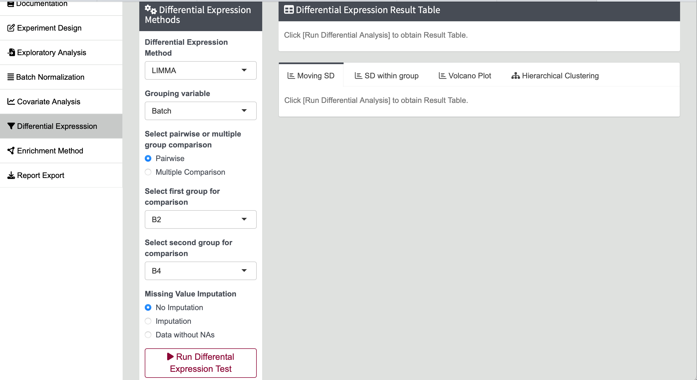
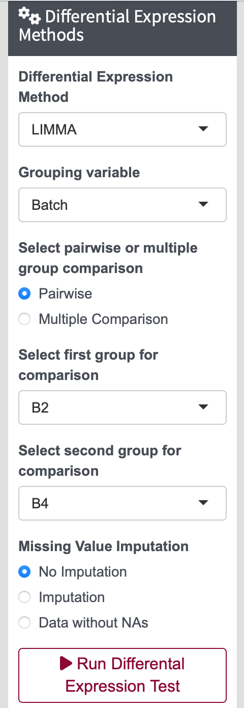
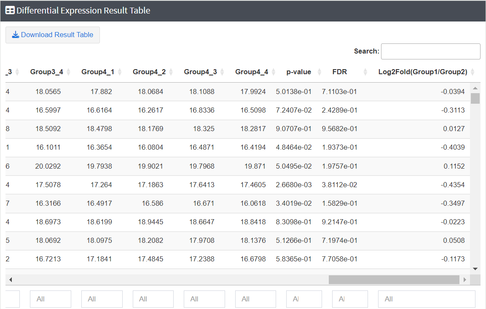
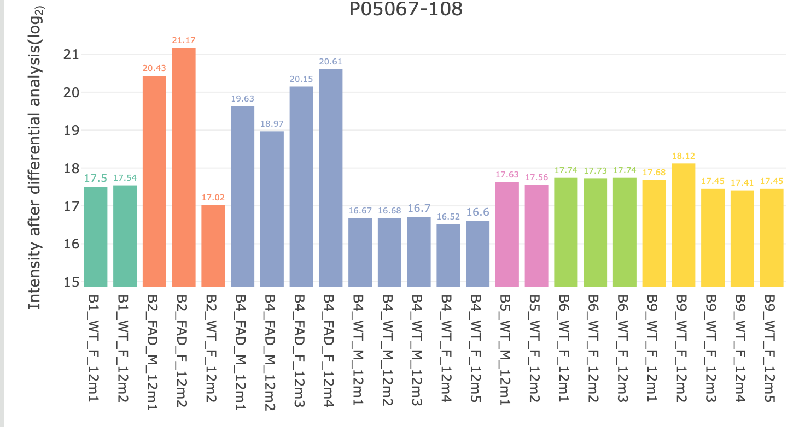
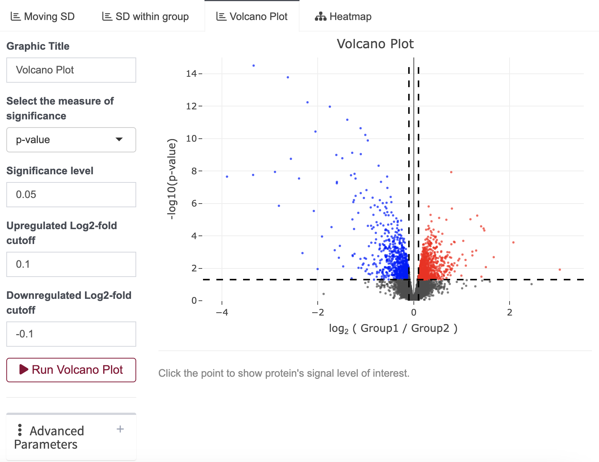
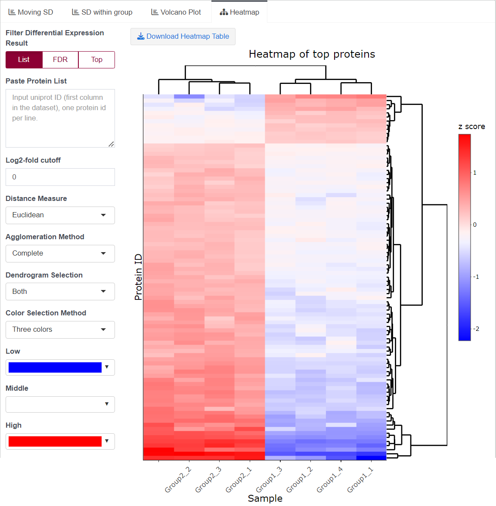

# Differential Expression

**Differential Expression** is a method used to identify proteins that show significant differences in expression levels between groups or conditions. By comparing the expression levels across different groups, such as diseased versus healthy samples, researchers can pinpoint specific molecules that are upregulated or downregulated, providing insights into the biological processes involved.  

---
## Steps for Differential Expression

1. **Navigate to Differential Expression Tab**

   Click on the `Differential Expression` tab in the left sidebar of this page.

   {width=90%}

2. **Adjust Differential Expression Parameters**  

   Under the `[Differential Expression Methods]` panel, adjust grouping variables for comparison: 
   
   - Select the statistical method, and adjust the grouping variables for comparison.  
   - Define the type of comparisons: pairwise or multiple group comparisons.  
   - Choose whether to perform data imputation before conducting the differential analysis.  
   
   JUMP shiny offers three options: no imputation, imputation using the minProb method, or excluding all proteins with missing values in any samples (i.e., Data without NAs). 
   
   For the **imputation**, JUMP shiny handles missing values based on the following four cases:  
   
   - If there are no missing values in all groups, no imputation is performed.
   - If one group has >1 values while the other groups have ≥1 values, no imputation is executed.
   - If one group is completely missing while the other groups have more than one value:
      Missing values are imputed with the top n minimum values sample wisely in the group. The number of missing values imputed is equal to maximum number of values in the other groups that have at least 2 values.
   - If all groups have only one value or are completely missing, this protein row is discarded from the differential expression analysis.  
   
   Imputing missing values can help minimize potential biases and make the dataset more complete, thereby improving the reliability of the results. Depending on your specific needs and the characteristics of your data, you can select the most appropriate option for your analysis.

   {width=30%}

3. **Run Differential Expression**

   After defining all parameters, click the `[Run Differential Expression Test]` button. The program will analyze your data and generate a result table, providing detailed information from the differentially expressed analysis. Depending on the type of comparison, the result table will include the p-value, FDR, and log2 fold change in the last three columns, along with the original expression levels (log2 transformed values) of each protein.

   You can click the header of each column to sort the proteins based on p-value, FDR, or log2 fold change. This functionality allows you to easily identify the most significant proteins according to your criteria. Additionally, by selecting a particular protein, you can view its expression levels across all samples.
   
   {width=90%}  
   {width=90%}

4. **Visualization of the Results of Differential Expression**

   - **Volcano Plot**  
   Displays the distribution of result data, highlighting significant proteins based on p-value and log2 fold change. This plot helps in identifying proteins with substantial changes in expression and their statistical significance, making it easier to identify key proteins in your analysis.  
   You can customize the volcano plot by defining the graphic title, significance levels (*p*-value or FDR), and the cutoff values for up-regulated and down-regulated log2 fold changes. The determination of up-regulation or down-regulation is based on the parameters specified in the `[Differential Expression Methods]` section, such as the order of the groups being compared.  
   To label proteins with gene symbols in the volcano plot, click the + in the advanced parameters section and enter the protein accession numbers you would like to highlight. Additionally, if you click on a point in the volcano plot, a bar plot will be displayed beneath it. This bar plot provides a detailed view of the expression levels of the selected protein across all samples, providing expression levels across all samples.

     {width=90%}

   - **Heatmap Plot**  
   Explores the relationships and similarities among samples and proteins within your dataset. You can define the list of proteins to include in the heatmap using one of three options: inputting a specific list of proteins, selecting proteins based on an FDR cutoff, or choosing the top n proteins based on FDR. Additionally, you can further refine the selected protein list by applying a log2 fold change filter.  
   To generate a customized heatmap plot, you can select different distance and agglomeration methods for the cluster analysis. Additionally, you have the option to generate dendrograms for samples, proteins, or both, depending on your analytical needs. You can also choose the color scheme for the heatmap, allowing you to tailor the visualization to your preferences.

     {width=90%}

   - **Standard Deviation (SD) Within the Group Plot**  
   Provides a distribution plot of the SD between samples within a group/condition. This plot helps visualize the variability within each group, offering information for setting the log2 fold change cutoff.  

   - **Moving SD Plot**  
   Provides a scatter plot that displays the SDs across a range of intensities from low to high. This plot allows you to observe how the variability of your data changes with intensity. By visualizing the SDs, you can apply different log2 fold change cutoffs for proteins with varying intensity levels.
