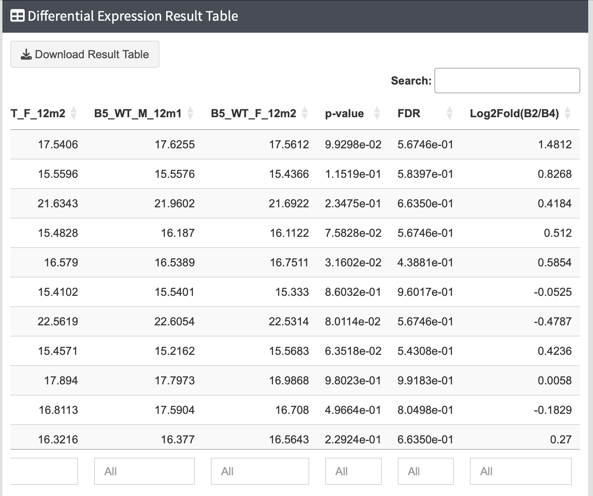
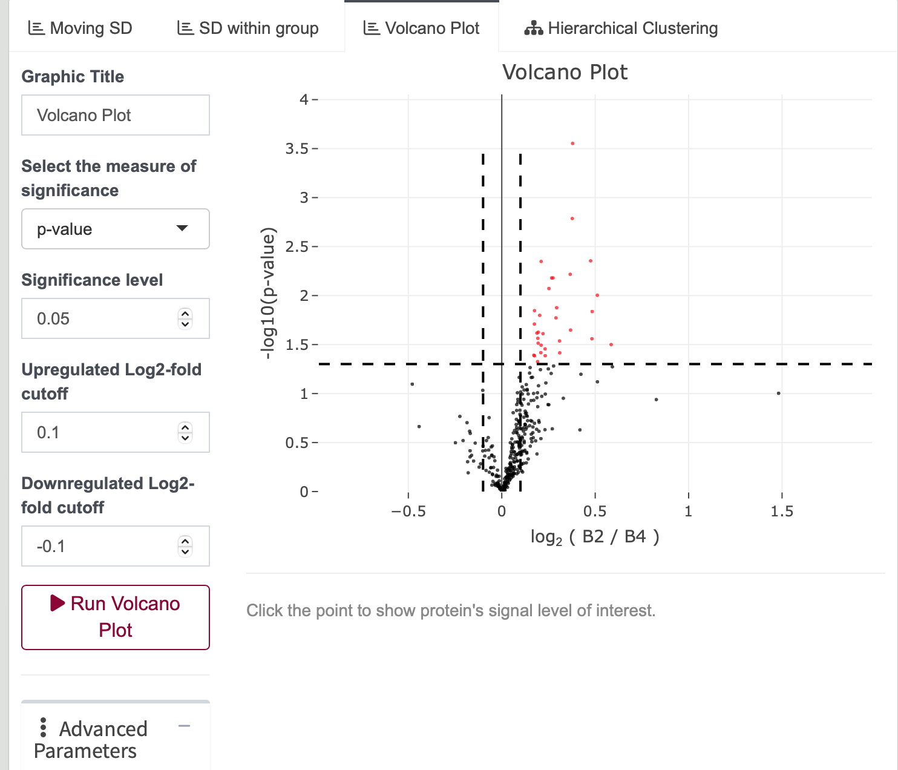

# Steps of Differential Expression Analysis

---

1. **Adjust Differential Expression Parameters**

   Under the `Differential Expression Methods` panel, adjust grouping variables for comparison.

   {width=30%}

   - Change grouping variables and compare with multiple groups.
   - The order of selection affects the log2 fold change result.
   - Note: Volcano plot is only applicable for pairwise comparison.
   - For pairwise comparison, imputation could be applied to dataset. Method for missing value imputation is explained below.

2. **Run Differential Expression Analysis**

   Click `Run Differential Expression Test` to initiate the differential expression analysis.

   {width=90%}

   - P-value, log2 fold change, and FDR will be shown in the last three columns.
   - Click on a specific row to display the barplot of the expression of each protein.
   
   {width=90%}  
   {width=90%}

3. **Visualization of Differential Expression Analysis**

   - **Density Plot**: Displaying the distribution of result data.
   
     {width=90%}

   - **Volcano Plot**: Illustrating significant values of interest. Click on an interested protein to display its expression values.
   
     {width=90%}

   - **Hierarchical Clustering**: Utilize various cut-off methods to construct a heatmap. Click `Run Heatmap` to generate the graph.
   
     {width=90%}
     
     
---
## Missing value imputation

<mark>Note: Currently, this option is only available for pairwise comparisons.</mark>

There are three options for Missing values imputation:  
{width=30%}  

1. `No Imputation`: The program will not perform any imputation or preprocessing on the data before differential expression analysis.
2. `Imputation`: The program will handle missing values based on the following four cases:
  - If there are no missing values in two groups, no imputation is performed.
  - If one group has >1 values while the other group has ≥1 values , no imputation is executed.
  - If one group is completely missing while the other group has more than one value, the missing values are imputed with the minimum value in the column(samplewise). The number of missing values imputed is equal to the number of values in the other group.
  - If both groups have only one value or are completely missing, the protein row is discarded from the differential expression analysis. 
3. `Data without NA`: Differential expression analysis will be performed only on proteins with complete intensity values.

