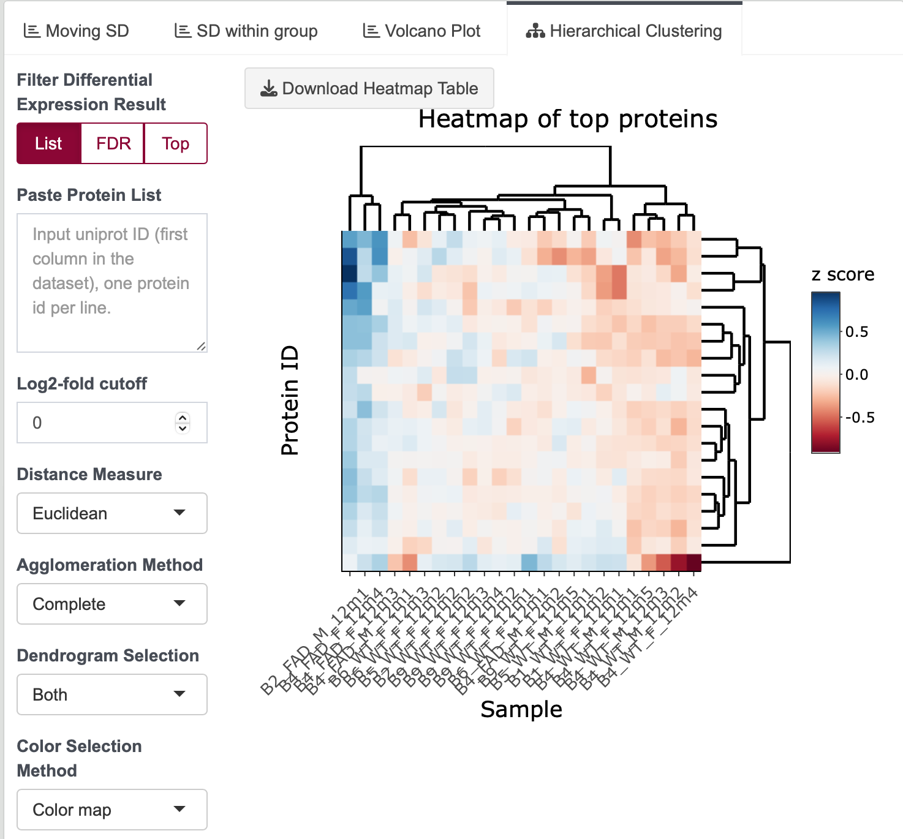

# Steps of Differential Expression Analysis

---

1. **Adjust Differential Expression Parameters**

   Under the `Differential Expression Methods` panel, adjust grouping variables for comparison.

   {width=30%}

   - Change grouping variables and compare with multiple groups.
   - The order of selection affects the log2 fold change result.
   - Note: Volcano plot is only applicable for pairwise comparison.
   - For pairwise comparison, imputation could be applied to dataset. Method for missing value imputation is explained below.

2. **Run Differential Expression Analysis**

   Click `Run Differential Expression Test` to initiate the differential expression analysis.

   {width=90%}

   - P-value, log2 fold change, and FDR will be shown in the last three columns.
   - Click on a specific row to display the barplot of the expression of each protein.
   
   {width=90%}  
   {width=90%}

3. **Visualization of Differential Expression Analysis**

   - **Density Plot**: Displaying the distribution of result data.
   
     {width=90%}

   - **Volcano Plot**: Illustrating significant values of interest. Click on an interested protein to display its expression values.
   
     {width=90%}

   - **Hierarchical Clustering**: Utilize various cut-off methods to construct a heatmap. Click `Run Heatmap` to generate the graph.
   
     {width=90%}
     
     
---
## Missing value imputation
1. If imputation is selected, JUMP shiny will:  
  - only impute the missing values in selected two groups  
  - only impute where all values in one group are completely missing
2. When one protein is required to impute missing value, JUMP shiny will replace the missing value with the minimum value in that sample.(columnwise)
