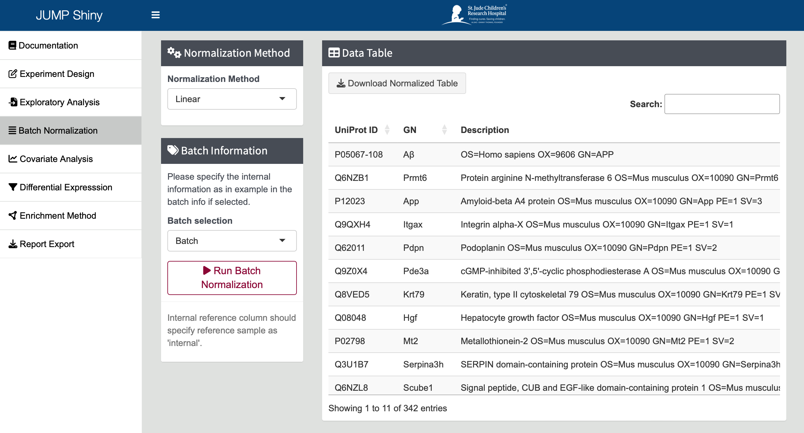
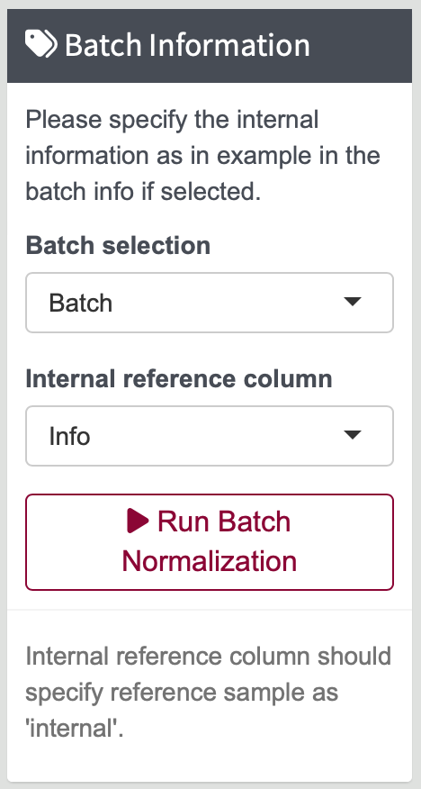
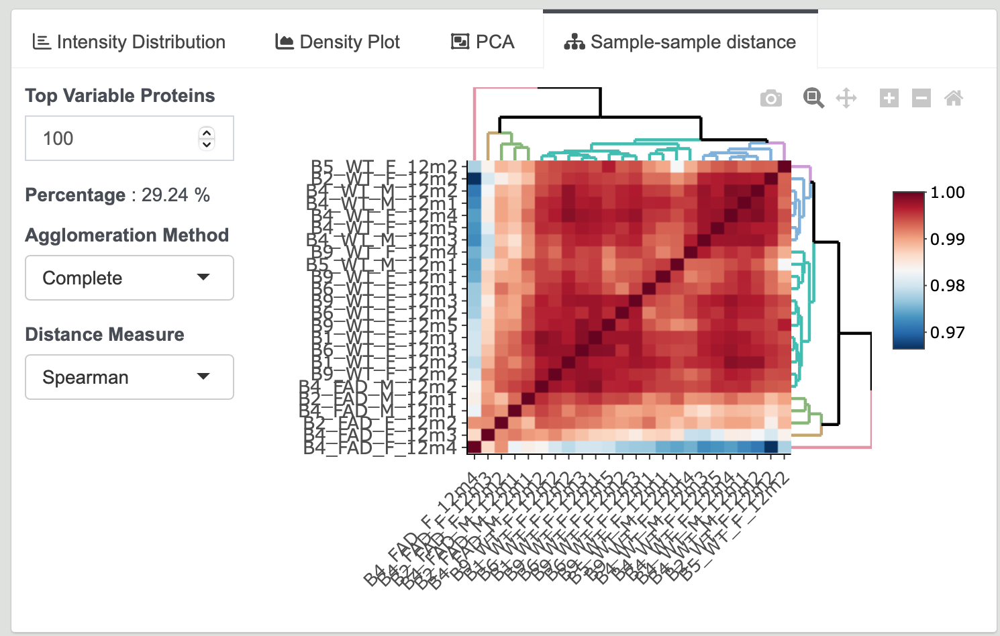

# Batch Normalization

**Batch Normalization** aims to correct unwanted technical variation in protein expression data arising from experimental batch effects. By applying normalization techniques, you can ensure that the observed differences in protein expression are due to biological variation rather than technical artifacts. This process offers several key benefits:  

- Improving the Accuracy of Differential Expression: Normalization helps in accurately identifying true biological differences by eliminating technical noise.
- Reducing the Impact of Batch Effects: It minimizes the influence of variations introduced during different experimental batches, leading to more consistent and reliable data.
- Enhancing the Reproducibility of Results: By standardizing the data, normalization ensures that the results are reproducible across different experiments and studies.

---

## Steps for Batch Normalization

1. **Navigate to Batch Normalization Tab**

   Click on the `Batch Normalization` tab in the left sidebar of this page.

   {width=90%}

2. **Select Normalization Method**

   Choose the appropriate normalization method based on your data:  
   
   `Internal`: If your data has an internal reference, such as TMT data, you can normalize the data based on an internal sample.   

   `Linear`: If your data doesn’t have an internal sample, select linear normalization. Linear normalization adjusts your dataset based on overall trends, bringing all samples to a common scale and correcting for systematic technical variations.

   `Internal+Linear`: If your data has an internal reference, you can choose first internal normalization and then linear normalization for better results.

   {width=30%}

3. **Selecting Batch Group Information**

   To perform batch normalization, please specify the necessary batch and internal reference as provided in the sample information file. Please use the dropdown menu to choose the relevant batch identifier and select the column that contains the internal reference sample information as provided in the sample information file. 

   Once you have selected the appropriate batch and internal reference column, click the `[Run Batch Normalization]` button to initiate the normalization process.

   Select your batch group column in the dropdown menu.  
   {width=30%}

   - **Internal Method:**
     Format: Include one more `Info` column. Make sure to specify the internal samples. 
     {width=30%}

   - **Linear Method:**
     Format: No need to have internal reference column.   
     {width=30%}

4. **Normalization Results**

   After normalization, the `Data Table` will appear on the right side of the page. Similar to the `Exploratory Analysis`, Intensity Distribution, PCA plot, and Sample Correlation are generated to assess the effectiveness of the normalization.

   {width=90%}
   
   {width=90%}
   
   {width=90%}

5. **Proceed to Differential Expression**

   Now, you can directly proceed to `Differential Expression` analysis.
