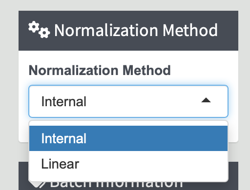
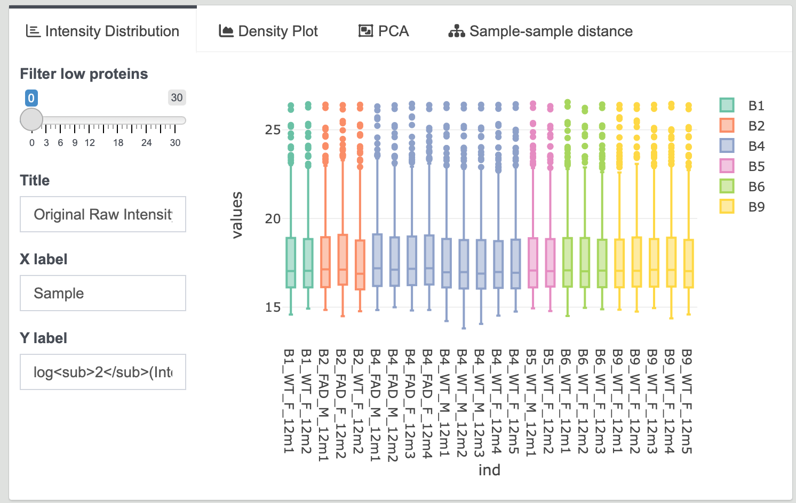
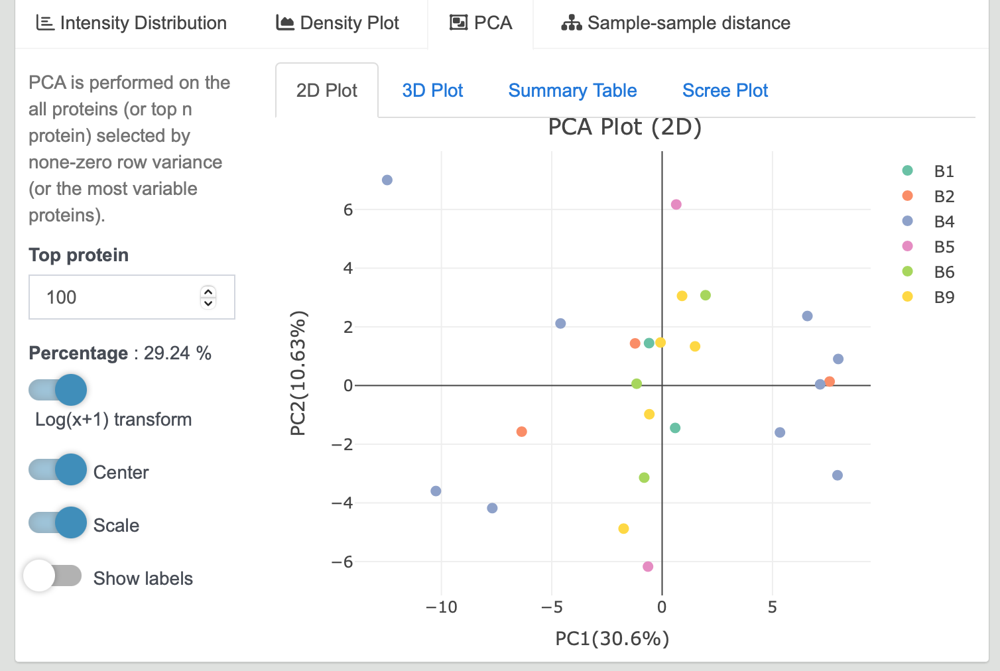

# Steps for Normalization

**Goal**: Correcting unwanted technical variation in protein expression data arising from experimental batch effects.

- Improving the accuracy of differential expression analysis.
- Reducing the impact of batch effects.
- Enhancing the reproducibility of results.

---

1. **Navigate to Batch Normalization Tab**

   Click on the `Batch Normalization` tab located in the left sidebar of this page.

   {width=90%}

2. **Select Normalization Method**

   Choose the appropriate normalization method based on your data:

   - If your data needs normalization based on an internal sample, choose `Internal`.
   - If your data doesn't have an internal sample, choose `Linear`.  

   {width=30%}

3. **Input Batch Group Information**

   Select your batch group column in the dropdown menu.  
   {width=30%}

   - **Internal Method:**
     Format: Include one more `info` column.  
     Select `internal` column for internal sample information. Make sure to specify the internal sample in the **info** column. 
     {width=30%}

   - **Linear Method:**
     Format: No need to have internal reference column.   
     {width=30%}

4. **Normalization Results**

   After normalization, the `Result Table` will appear on the right of the page. Similar to `Data Import`, `Intensity Distribution` and other plots will be drawn simultaneously.

   {width=90%}
   
   {width=90%}
   
   {width=90%}

5. **Proceed to Covariance Correction or Differential Expression Analysis**

   Now, you can choose to perform `Covariance Correction` or proceed directly to `Differential Expression` analysis.
