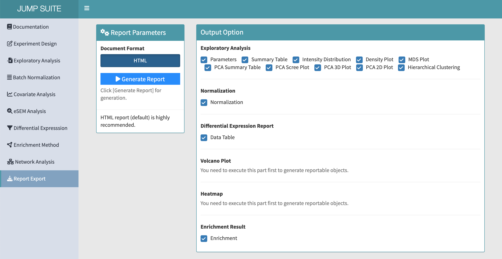

# Generate HTML Report

---

Click `Generate Report` to create an HTML profile. Subsequently, click the `Download` button to save the report.

{width=90%}

---

#### Parameters

Customize the content of the report by selecting specific plots and tables to be included.

**Note:**
- Ensure that you have performed the corresponding analyses to generate the graphs and tables you wish to include in the report.
