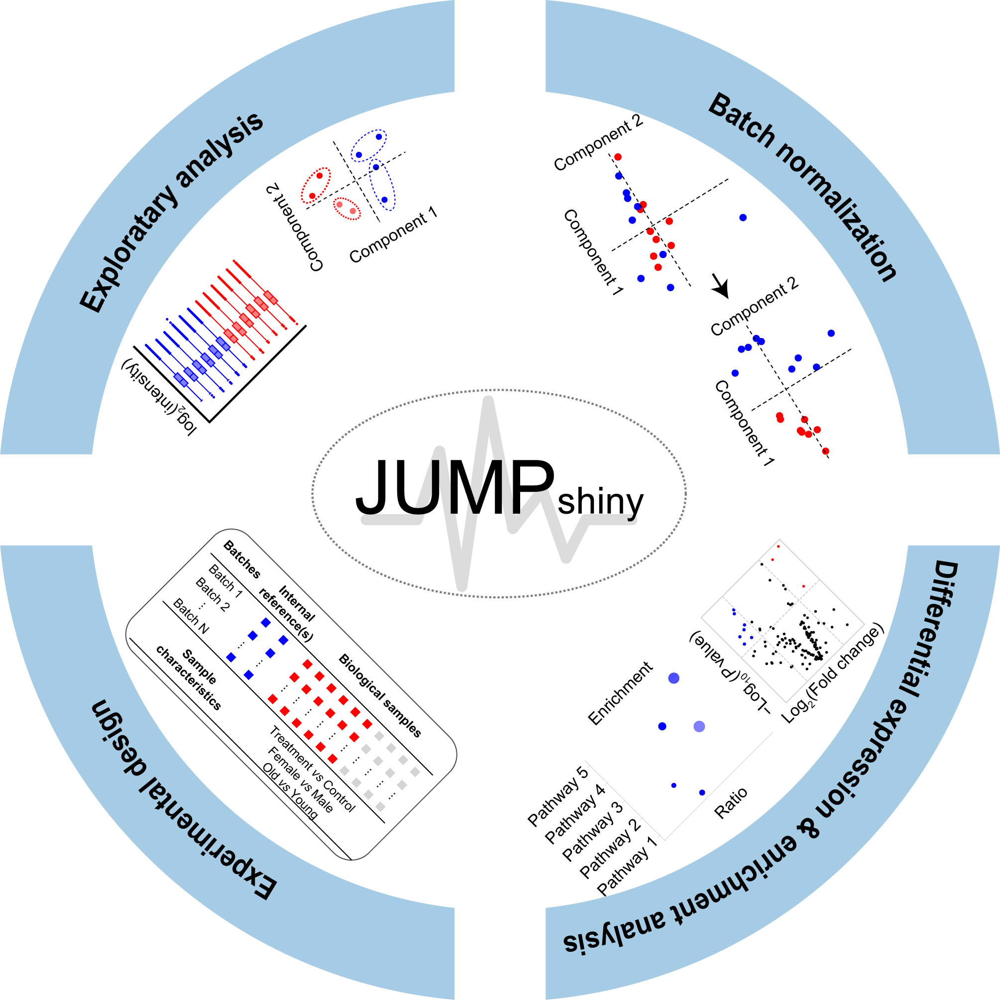

## Welcome to JUMP Shiny

{width = 50%}

JUMP Shiny is a comprehensive web platform designed for mass spectrometry-based proteomics analysis. JUMP Shiny offers a wide range of analytical tools, including experimental design, exploratory analysis, batch normalization, differential expression and enrichment pathway analysis.
This platform provides intuitive visualizations and functionalities that facilitate in-depth exploration of proteomics data.
The tutorial tab will guide you through user interface, functionalities, and detailed steps to perform the analysis.

### Contact Information 
Aijun Zhang: azhang16@uthsc.edu  
Xusheng Wang: xwang39@uthsc.edu

Wang Lab@2025: https://wang.lab.uthsc.edu/

### Acknowledgement
Part of the code was adapted from project [TCC-GUI]("https://github.com/swsoyee/TCC-GUI") under MIT license. We truly appreciate and respect their contributions.

