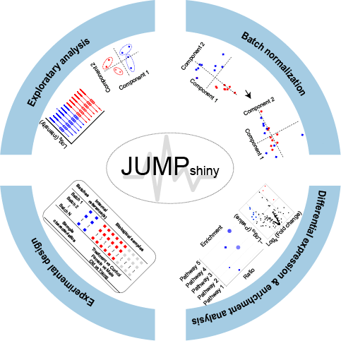

## Welcome to JUMP Shiny

{width = 50%}

JUMP Shiny is a comprehensive web platform designed for mass spectrometry-based proteomics analysis. JUMP Shiny offers a wide range of analytical tools, including experimental design, exploratory analysis, batch normalization, differential expression and enrichment pathway analysis.
This platform provides intuitive visualizations and functionalities that facilitate in-depth exploration of proteomics data.
The tutorial tab will guide you through user interface, functionalities, and detailed steps to perform the analysis.

### Citation
If you use JUMPshiny in your work, please cite:

Zhang, A., Fu, Y., Yuan, Z.-F., Wu, L., Kong, D., Li, L., Wu, Z., Prins, P., Peng, J., & Wang, X. (n.d.). JUMPshiny: A User-Friendly Platform for Comprehensive Analysis and Visualization of Quantitative Proteomics Data. PROTEOMICS, n/a(n/a), e70061. https://doi.org/10.1002/pmic.70061

### Contact Information 
Aijun Zhang: azhang16@uthsc.edu  
Xusheng Wang: xwang39@uthsc.edu

Wang Lab@2025: [Lab Website](https://wang.lab.uthsc.edu/)

### Acknowledgement
Part of the code was adapted from project [TCC-GUI](https://github.com/swsoyee/TCC-GUI) under MIT license. We truly appreciate and respect their contributions.

