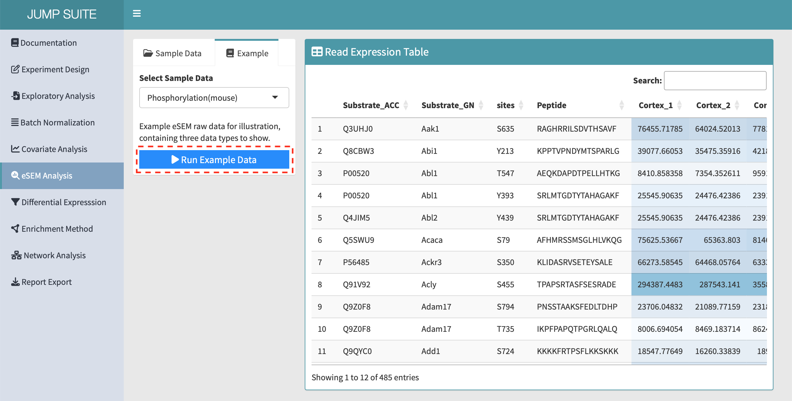
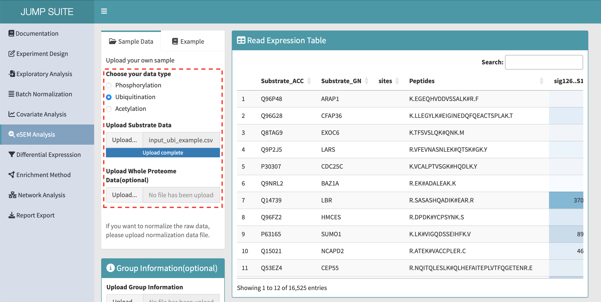
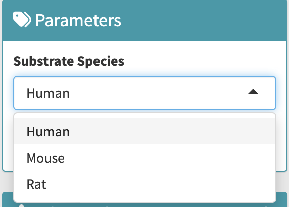
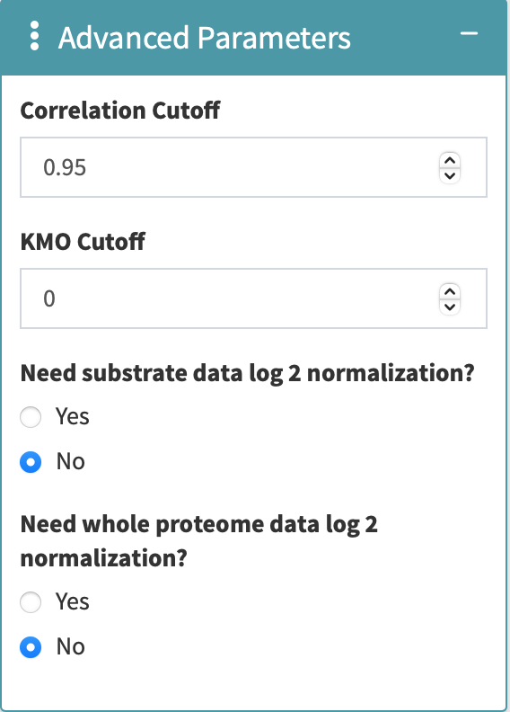
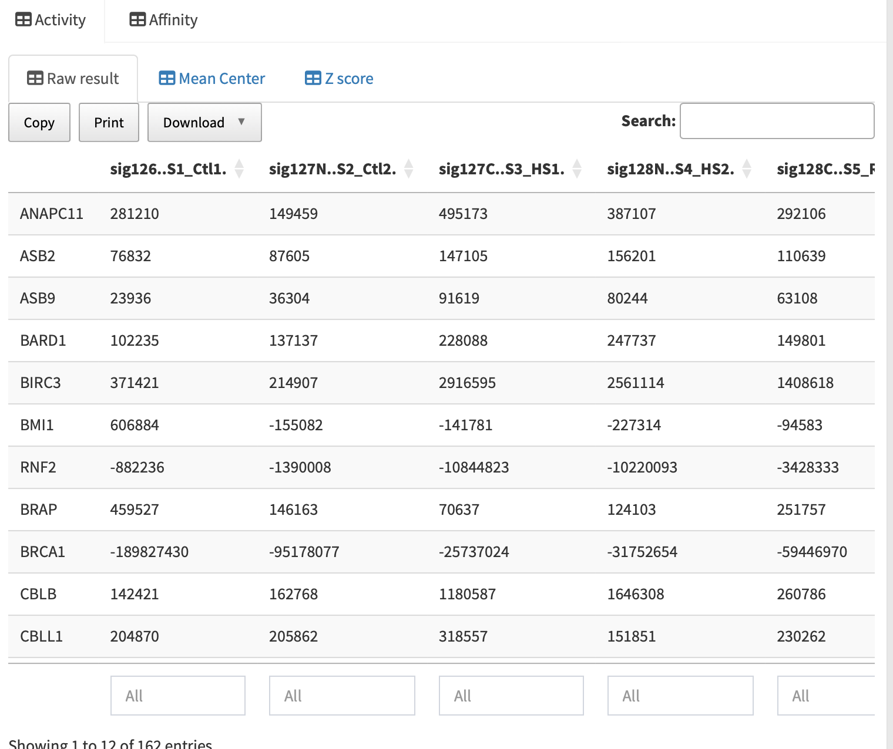
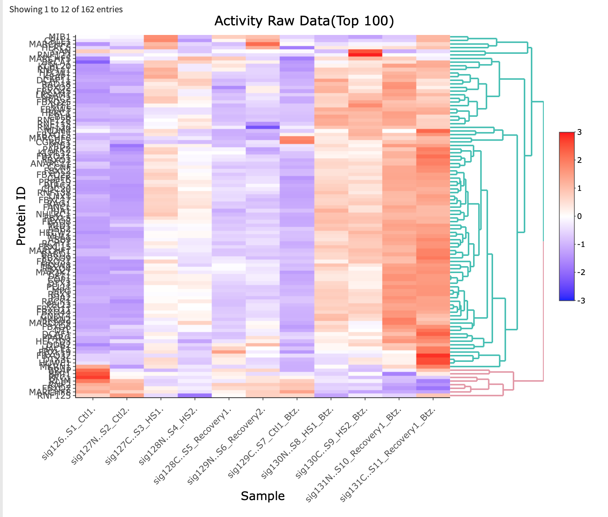
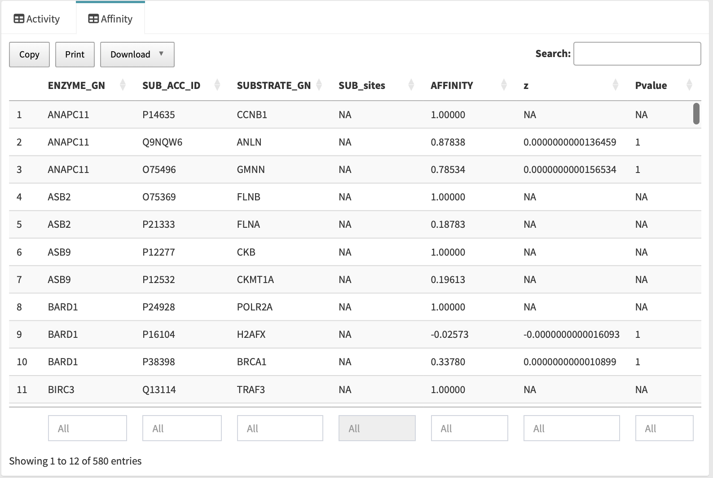

# eSEM Analysis Manual

---

**[eSEM]** is an R package designed for inferring enzyme activity from phosphorylation, ubiquitination, and acetylation. This package is developed by the Wang Lab.

## eSEM Analysis: Graphical User Interface

In this online version of the eSEM package, users can easily set up parameters just like in the standalone package. Additionally, it provides plotting options for users to directly visualize the results.

---

## Example Steps

1. Navigate to the `eSEM Analysis` tab.
2. Find three example datasets for illustration under `Example data`.
3. In the `Select Sample` section, choose the data type.
4. Click `Run Analysis` to view the sample result on the top right.
   Default parameters for examples are already set.
   {width=90%}

---

## General Steps

1. Click the `Sample` tab.
2. Select the data type and upload your substrate data (**necessary**).
3. If you have a group information file, upload it under `Group Information (Optional)`.
4. If you need whole proteomics data for normalization, upload it under `Normalization Data (Optional)`.
   {width=90%}
5. Select the species of the substrate, which is **required**, under `Parameters`.  
   {width=30%}  
6. Adjust additional parameters in the package under `Advanced Parameters`.  
   {width=30%}
7. Click `Run eSEM Analysis` and wait for the result!  

---

## Result

- **Activity**:
  Three tables and heatmaps of `Raw Result`, `Mean Center`, and `Z score` will be shown.
  {width=90%}
  {width=90%}

- **Affinity**:
  A table of affinity results will be displayed.
  {width=90%}
